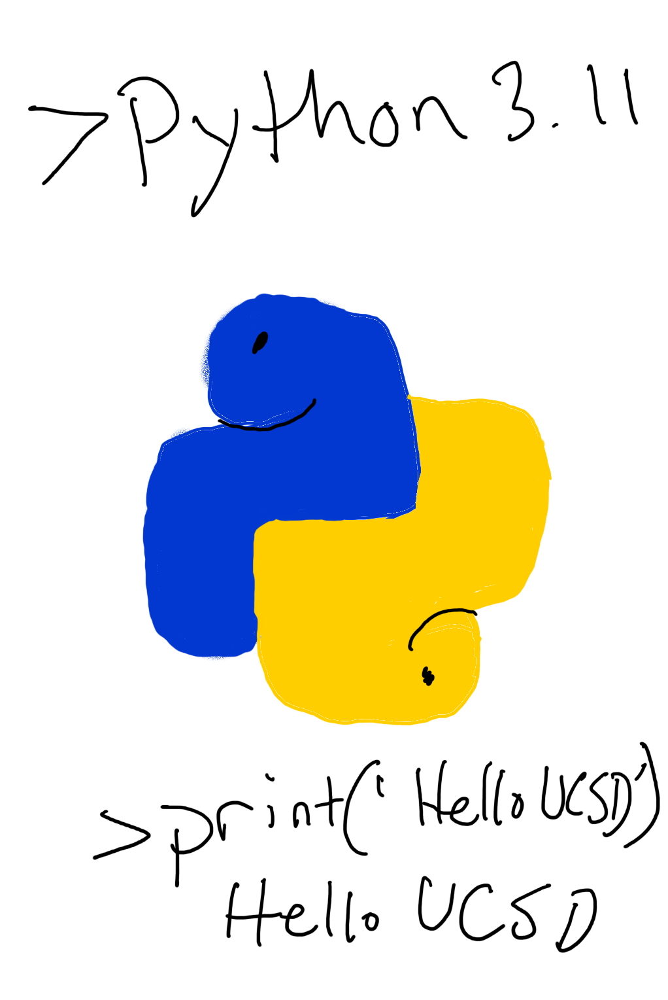

# UCSD CSE8A SSII 2024 Introduction to Python

- [Edwin Solares](http://edwinsolares.com) (Instructor)

[Basics](#basics) -
[Schedule](#schedule) -
[Course Components](#syllabus) -
[Staff &amp; Resources](#staff-resources) -
[Grading](#grading) -
[Policies](#policy)

In this course, we'll explore a number of **Software Tools & Techniques** that are used commonly by developers in their day-to-day work. You'll learn how to manage files and programs from the command line, and you'll get direct practice (and build muscle memory!) with keyboard shortcuts, tricks, and techniques for managing data and programs. Throughout, you'll exercise and improve your skills in program understanding and debugging.

This web page serves as the main source of announcements and resources for the course, as well as the syllabus.

## Basics

- Lecture: 
  - In person: [Pepper Canyon Hall 122](https://map.concept3d.com/?id=1005#!ct/18312,63891,65653?m/246320?s/PCYNH_Main?mc/32.8794361313778,-117.23379499999999?z/18?lvl/0?share), Mon-Thurs (9:30am-10:50am)
  - Remote: Discord #livestream channel 9:30am-10:50am. Recordings available after via Podcasts.
- Discussion:
  - In person: Pepper Canyon Hall 109, Mon (11:00am - 12:50pm)
  - Remote: Discord #livestream channel 11:00am-12:50pm. Recordings available after via Podcasts.
- Labs: 
  - In person: [Computer Science Engineering Basement B260](https://map.concept3d.com/?id=1005#!m/164780) Wednesday (11am or 1pm)
  - Remote: [https://ucsd.zoom.us/j/92177661143](https://ucsd.zoom.us/j/92177661143) Wednesday (3pm or 5pm)
- PA's/Homework:
  - [Prairie Learn Link](https://us.prairielearn.com/pl/login) - Under the homework section (autograded)
- “Skill Demonstration” Exams: Flexible scheduling in weeks 2,3,4 and 5
  - [Prairie Test Link](https://us.prairietest.com/) - signing up and taking the skill demos (autograded)
  - In person: Register TTC slots via Prairietest link above
  - Remote: Register via Remote zoom slots via Prairietest link above
  
- Final Exam (used for making up test credit): Flexible scheduling throughout the quarter. Maximum of 1 Make up for Skill Demos.

- Podcasts: [podcast.ucsd.edu](https://podcast.ucsd.edu)
- General Class Q&A Forum: Discord link on Canvas!
- Code Q&A Forum: [Piazza](https://piazza.com/class/lzh47a2eus718n)
- Gradescope: [https://www.gradescope.com](https://www.gradescope.com)
- Textbook/readings: There's no official textbook, but we will link to
  different online resources for you to read to supplement lecture. There are a few good general overall resources if you want others to peruse, but these aren't required:
  - [Intro to Programming in Python](https://stepik.org/course/84164/) by Soosai Raj, et al.  Available for free on Stepik (requires you to create an account).
  - [Learn AI-Assisted Python Programming](https://www.oreilly.com/library-access/?next=/library/view/learn-ai-assisted-python/9781633437784/) by Porter and Zingaro.  Available for free as an eBook through the UC San Diego library (requires SSO).

## Office Hours Calendar
<iframe src="https://calendar.google.com/calendar/embed?height=600&amp;wkst=1&amp;mode=WEEK&amp;src=c_89c1bd3b3ca6b86f1b2bc132ac7a080578f9de29bfac1384763f45651131cb56%40group.calendar.google.com&ctz=America%2FLos_Angeles" style="border: 0" width="800" height="600" frameborder="0" scrolling="no"></iframe>
<!-- <iframe src="https://calendar.google.com/calendar/embed?src=c_20fa0da1f4a3e319f0e14594281a18ffc302f315e85c6aeb018cb5500f1a4ef9%40group.calendar.google.com&ctz=America%2FLos_Angeles" style="border: 0" width="800" height="600" frameborder="0" scrolling="no"></iframe>
-->

## Schedule

The schedule on the sidebar outlines topics, due dates, and links to assignments. The
schedule of lecture topics might change slightly, but I post a general plan so
you can know roughly where we are headed.

## Syllabus

There are several components to the course:

- **Lecture sessions**
- **Weekly quizzes**
- **Weekly Homework**
- **Weekly Lab sessions**
- **Lab reports**
- **Skill Demonstrations**
- **Project**

### Homework

Homework is released on a platform called PrairieLearn, and will generally consist of programming exercises and multiple choice questions. They are due the Sunday after they are released.

### Labs

The course's lab component meets for 2 hours. In each lab you'll switch between
working on your own, working in pairs, and participating in group discussions
about your approach, lessons learned, programming problems, and so on.

The lab sessions and groups will be led by TAs and tutors, who will note your
participation in these discussions for credit. Note that you must
**participate**, not merely **attend**, for participation credit. Furthermore, if you do not finish all PrairieLearn tasks by the end of lab, you will have until the day to complete those tasks for lab credit. PrairieLearn tasks and participation both equally contribute to your lab grade.

If you miss lab, you'll still be held accountable for understanding the
relevant material via Skill Demonstrations and Lab Reports. You can miss 1 labs
without it impacting your grade (see [Grading](#grading) below). There is no
way to make up a lab, even for illness, travel, or emergencies. My preference
would be to require all 5 labs for an A, and have some kind of excused
absences. However, tracking excused absences doesn't really scale, so the “one
for any reason” policy is how we handle it. You don't need to justify your
missed labs. Contact the instructor if you'll miss more than 1 labs for
unavoidable reasons.

### Lecture Sessions

Lecture sessions are on Monday through Thursday.

**For Remote students**: Livestream will be available Monday-Thursday @9:30am for lectures and Monday 11am for discussions via Discord.

In each lecture, we'll have a paper handout (also available electronically) starting Week 1 Tuesday. At
the end of lecture you'll have a chance submit your handout to Gradescope. You
can do this by scanning it in the Gradescope app (for iOS and Android) or
through the web interface. To get participation credit for lecture, you have to
submit a handout filled in with reasonable effort. It's fine if answers aren't
right, and some days don't have right answers. It's fine if things aren't
totally complete, and some days we won't finish everything. But it should be
clear from what you submit that you followed along and worked on the exercises we did in class.

If you miss class, you can submit them up until the start of the next class as
late submissions.  We recommend completing them while watching the podcast.
We'll have TAs on hand as backup to collect the physical paper/help you scan and
submit if you have any issue submitting. See [Grading](#grading) below for the
required submissions and how that impacts your grade.

### Discussion

Discussions will take place on Mondays at 11am and are led by your teaching assistants.
The purpose of discussions is to review materials covered in lecture, labs, homework, and previous skill demos. There will also be extra coding exercises covered as well. This is the time for you to ask the teaching staff to clarify any questions you may have about the material.
Starting from week 2, participation in discussions is mandatory and contibutes towards your Discussion and Lecture Participation grade.

### Weekly Quizzes

Each week there will be an online quiz on PrairieLearn. The purpose of this quiz is to make sure everyone has checked in on the concepts we will be using in lab on Wednesday and Thursday. They are open for late submission until the end of the quarter, but
see grading below for how late submissions correspond to grades.

Sometimes quizzes have associated readings or videos to supplement lecture.

<!--
Each week there will be an online, untimed, multiple-tries quiz due on
_Wednesday at 9 am_. 

### Lab Reports/Portfolio Posts

Every other Wednesday (that's in weeks 2, 4, 6, 8, 10) you will submit a lab report on
work from the previous week or two of lab material. This will take the form of
a blog post on a personal site you created in the first week.  At the end of
the quarter this means you'll have a personal web site with 5 posts detailing
what you learned.

For each post, our staff will review it and give a **0-3** score along with feedback:

- **3** for a complete submission of professional quality that covers all the expectations listed in the report
- **2** for a complete submission with some mistakes, some unclear writing, or some confusing or nonstandard formatting
- **1** for a submission missing key components, or clear inaccuracies in multiple components
- **0** for no submission, a blank submission, or a submission of something irrelevant

After each lab report is graded, you'll have a chance to *resubmit* it based on the feedback you received, which will detail what you need to do to increase your score. The resubmission deadline is two weeks after the original deadline.

- For an original score of **0** or **1**, you can raise your score to **2** (but not to **3**)
- For an original score of **2**, you can raise your score to **3**

This is also the only late policy for lab reports. Unsubmitted reports are initially assigned a **0**, and can get a maximum of **2** points on resubmission.
-->

### Skill Demonstrations

Several times during the quarter, you will complete a _skill demonstrations_ via PrairieTest
-- this course's version of exams. You'll be given a problem to practice in
advance, and then in the demo you'll demonstrate that you can do the task plus some follow-up tasks that are presented during the demonstration.
You can look at the skill demonstrations
from previous offerings for a sense of what tasks we assign (though we may or
may not use the same types in this offering)

During week 5, you'll have the opportunity to improve scores for one skill demonstrations. Sign ups for these make up skill demos will be released during week 4. If you miss the skill demonstration for any reason, it counts as a Try Again.

There will be skill demonstrations in weeks 2, 3, 4, and 5 of the quarter. More details
about how you'll complete them will be shared in lab (you'll practice the format and we'll talk about
scheduling them).

Skill demonstrations will take place in CSE B250, **unless you have an AFA letter**. You must schedule a time to take your exams in advance. To do this, visit prairietest.com and log in with your UCSD-associated Google account. From there, you will be able to see the exams available for reservation. Scheduling of exams will open on every Friday starting week 1.

Students requesting accommodations for this course due to a disability must provide a current Authorization for Accommodation (AFA) letter (paper or electronic) issued by the Office for Students with Disabilities (osd.ucsd.edu). Students are required to discuss accommodation arrangements with instructors and OSD liaisons in the department IN ADVANCE of any exams or assignments. Students with approved accommodations will be taking their exams at the Triton Testing Center. Exams must be scheduled at least 72 hours in advance at http://tritontesting.ucsd.edu.   

## Grading

In order to get an A in the class it is recommended that you get an A in each component of the course. A+'s will be assigned at the end of the quarter and only to students showing exemplary accomplishments across all components of the course, and have shown strong collaboration with their peers.

A table that contains the grading scheme data. Each row contains a name, a maximum percentage, and a minimum percentage.

| Letter | Grade	Range |
| --- | --- |
A	| 100% to 94%
A-| < 94% to 90%
B+| < 90% to 87%
B | < 87% to 84% 
B-| < 84% to 80% 
C+| < 80% to 77% 
C | < 77% to 74% 
C-| < 74% to 70%
D |< 70% to 60% 
F | < 60%

** A+'s will be assigned to those that performed exemplary throughout the quarter at the instructors discretion
** If a student fails to get 55% at any category (shown below) of the class, it will result in an F for the course.

The weighted breakdown of each category is as follows:

| Category | Percentage |
| --- | --- |
Discussion and Lecture Participation | 5%
Quizzes | 15%
Homeworks | 10%
Project | 15%
Skill Demos | 40%
Lab | 15%

## Policy

## Academic Integrity

Individual assignments describe policies specific to the assignment. Some
general policies for the course are here.

### Artificial Intelligence

You **can** use an AI assistant like ChatGPT or Copilot to help you write code in this class. If you do, you are **required** to include
a section that shows:

- The prompts you gave to ChatGPT, or the context in which you used Copilot
  autocomplete
- What its output was and how you changed the output after it was produced

This helps us _all_ learn how these new, powerful, and little-understood tools
work (and don't).

### Skill Demonstrations and Academic Integrity

Instructions for skill demonstrations will be posted in the week before they happen.
You're free to collaborate with others on preparing for
the skill demonstration, trying things out beforehand, and so on.

You **cannot** share details of _your_ skill demonstration with others until
after you receive your grade for it. You **cannot** communicate with anyone during the skill demonstration.

### Quizzes and Academic Integrity

You can work on weekly quizzes with other students.

## Anticipated Frequent Questions

**Can I attend a lab section other than the one I'm enrolled in?**

No, please do not try to do this. The lab sections have limited seating and are
full. We cannot accommodate switching.

**How can I switch sections?**

You have to drop and re-add (which may involve getting [back on] the waitlist).
Sorry.

**What do I need to do to get an A?**

See the grading section above.

**Can I leave lab early if I'm done?**

The labs are designed to not be things you can “finish”. Labs have plenty of
extension and exploration activities at the end for you to try out, discuss,
and help one another with. Co-located time with other folks learning the same
things is precious and what courses are for. Also, if you need an extrinsic
motivation, you won't get credit for participation if you don't stay, and
participate, the whole time.

**Do I have to come to lab?**

Yes, see grading above.

**What should I do if I'm on the waitlist?**

Attend and complete all the work required while waitlisted (this is consistent
with [CSE
policy](https://cse.ucsd.edu/undergraduate/courses/enrolling-cse-courses)).

**I missed lecture/have to travel for a lecture, what should I do?**

Find the associated handout for the week above, watch the
[podcast](https://podcast.ucsd.edu), and hand in a
scan/digital PDF of the handout to Gradescope before the next class.

**I missed the late deadline for a lecture handout submission, what should I do?**

You cannot submit a lecture handout after the posted deadline on Gradescope;
move on and focus on getting to the next ones!

**I missed lab, what should I do?**

You cannot makeup missed lab credit (but have a few “allowed” misses). Make
sure you understand the material from lab because it will be used on skill
demos and lab reports; try to do the parts that don't involve discussion on
your own, and review your group's lab notes.

**I missed a quiz deadline, what should I do?**

You can submit it late until the end of the quarter. Generally we allow lots
(think like 1/3 to 1/2) of the quizzes to be late without it impacting your
grade, but do take them seriously before lab so you're prepared.

**I missed a lab report deadline, what should I do?**

One week after each lab report deadline there is a late/resubmission deadline.
You can resubmit then. See the lab report section above for grading details
about resubmissions. Note there will be no resubmission for the last lab report.

**I missed a lab report resubmission deadline, what should I do?**

You cannot get an extension on lab report resubmissions; we cannot support
multiple late deadlines and still grade all the coursework on time.

**I missed my skill demonstration time, what should I do?**

You will need to use your 1 make-up. No other make-ups are allowed.
Scheduling: Stay tuned for announcements about scheduling make-ups in finals week.

**Where is the financial aid survey?**

We do this for you; as long as you submit a quiz, lecture handout, or do a lab
participation in the first week, we will mark you as commencing academic
activity.

