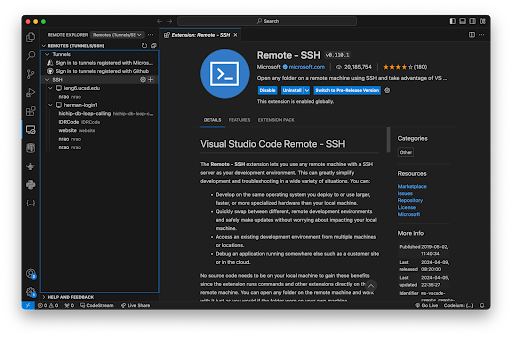

# Week 3 – VSCode and Your Local Machine

## Lecture Materials

  - [Monday Lecture Handout (Slides)](https://docs.google.com/presentation/d/1Q207K_3xfZFjZ2rym9ie3XLZjBo8uvKb/edit?usp=share_link&ouid=107408851252378993524&rtpof=true&sd=true)
  - [Monday Lecture Handout (PDF)](https://drive.google.com/file/d/1iIC0GcET6Gmsr_Kz-MN1YblpBVSMcM6k/view?usp=share_link)

### To Read/For Your Reference

- [Visual Studio Code](https://code.visualstudio.com/)
- Read these two articles by Julia Evans (one summarized in a comic below):
    - [When debugging, your attitude matters](https://jvns.ca/blog/debugging-attitude-matters/)
    - [How I Got Better at Debugging](https://jvns.ca/blog/2015/11/22/how-i-got-better-at-debugging/)
- Read this article by John Regehr: [How to Debug](https://blog.regehr.org/archives/199)
    - You don't need to know what all the technical tools are in these readings (systems programming, CSS, divs, etc)
- From the Regehr article, focus on the vocabulary (symptom, bug, etc); from the Evans articles, focus on the vibes
- This article: [https://drive.google.com/file/d/1zbMVZxsI1zOBPhSsvBi4kB5dPJuxyOJh/view?usp=sharing](https://drive.google.com/file/d/1zbMVZxsI1zOBPhSsvBi4kB5dPJuxyOJh/view?usp=sharing)
  (Note that assigning an article doesn't necessarily mean we all agree with everything in it...)

### Video Shorts

<iframe width="560" height="315" src="https://www.youtube-nocookie.com/embed/XJBUw3sNeuk" title="YouTube video player" frameborder="0" allow="accelerometer; autoplay; clipboard-write; encrypted-media; gyroscope; picture-in-picture; web-share" allowfullscreen></iframe>

<iframe width="560" height="315" src="https://www.youtube-nocookie.com/embed/hIqa1EoqIBM" title="YouTube video player" frameborder="0" allow="accelerometer; autoplay; clipboard-write; encrypted-media; gyroscope; picture-in-picture; web-share" allowfullscreen></iframe>

<iframe width="560" height="315" src="https://www.youtube-nocookie.com/embed/ZsCVRkR_nik" title="YouTube video player" frameborder="0" allow="accelerometer; autoplay; clipboard-write; encrypted-media; gyroscope; picture-in-picture; web-share" allowfullscreen></iframe>

<iframe width="560" height="315" src="https://www.youtube-nocookie.com/embed/M_S88_2t1UE?cc_load_policy=1" title="YouTube video player" frameborder="0" allow="accelerometer; autoplay; clipboard-write; encrypted-media; gyroscope; picture-in-picture; web-share" allowfullscreen></iframe>

## Lab Tasks

As usual, we publish these ahead of time, but they aren't guaranteed to be final
until the start of lab on Tuesday.

### Part 1 – SSH Keys & SCP

#### Step 1 SSH Keys

With the setup we've used so far this quarter, each time you log in to your
course-specific account, you have to type the password. You might have noticed
that during the skill demonstration you didn't have to type the password for our
instructor accounts! Here, you'll learn how to configure that for yourself (it
will save _lots_ of time).

- In your local terminal (the one you opened in VSCode), run `ssh-keygen`
- Keep entering `<Enter>` until the program shows some text it calls the "randomart image".
  - Note the path where the public key is saved (underlined below). 
  - 
 
**Write down in notes:**
The `ssh-keygen` command generates a public-private key pair; use the `cat` command to print out the content to each of these files. Include the two screenshots in the doc.

#### Step 2 SSH Copy ID

Now we have the key generated. Let’s configure it in our remote ieng6 server!
All you need to do is to type the following command:
```
ssh-copy-id -i ~/.ssh/id_rsa.pub YOUR_TRITONLINK_USERNAME@ieng6.ucsd.edu
```

Make sure you type in `yes` when it asks "Are you sure you want to continue connecting...?" 
and then type in your TritonLink password to confirm. The whole terminal interaction
should look something like below: 


**Write down in notes:**
What happened? What did you see? Put the screenshot of the output in the lab doc and explain what you think happened. Discuss with your peers!

So, to explain what happened, we first have to understand how ssh works. Imagine your server is like your home and you have a dog living inside. You can either enter your home with your keys or have your dog open it from the inside(it’s a very smart dog like a German Shepherd). For your dog to do that, the dog has to make sure you are you. So, you probably put a piece of your clothes with your scent at home for your dog to be familiar with your smell. Then every time you are outside, the dog will recognize you from your smell, that is the same from the clothes you left at home. Then open the door for you! 

The dog here will be the ssh system, and the clothes you left inside is the public key that you just sent to the ieng6 server with ssh-copy-id. Now when you try to access ieng6. The ssh system will automatically locate the private key in your local computer and compare it with the public key that it stored to verify your identity!

**Write down in notes:**
Check in the `.ssh` directory; there should be a file named `authorized_keys`. Compare the content of `authorized_keys` with the ones of public-private key pair files; which file (public or private key) has the same content as `authroized_keys`. Why is that? Discuss with your peers.

Try to log in and log out one more time. You shouldn't need to enter your password. Yeah!
```
$ ssh user@ieng6.ucsd.edu
```
```
$ exit
```

#### Step 3 SCP From Remote SSH to Local

Now that we have done the SSH to the remote server, we can now practice how to move files from our remote server to our local computer. 

In order to move a file, we use the command [SCP](https://www.geeksforgeeks.org/scp-command-in-linux-with-examples/).


**Reminder: What does [`echo`](https://www.geeksforgeeks.org/echo-command-in-linux-with-examples/) do?**

General format for `echo` is:

> `echo <insert text> > <insert name and type of file>`

Use `echo hello joe > hello.txt`

The `>` arrow means write “hello joe” to a file called `hello.txt`

You can read [man SCP](https://linux.die.net/man/1/scp) to get more ideas on this.

SCP command usage: The `scp` command in Unix is used to securely copy files and directories between two locations over a network. It utilizes `SSH` (Secure Shell) for data transfer, ensuring that the data is encrypted and secure during the copy process. To use `scp`, simply specify the source file and the destination path where the file should be copied. You should **not** be on the remote server when executing this command. The point of SCP is to copy files from your local computer to your remote server.

The general format is as follows:

> `scp <file to be copied from local computer> <server address>`

> `scp hello.txt username@ieng6.ucsd.edu:~/`

To copy entire folders or a couple of files we can use `scp -r` (`-r` means recursive copy which iterates through your entire folder and copies everything from one folder) to copy **recursively**.

**Write down in notes:**
Show a screenshot of you running the `scp` command above!

### Part 2 – Connecting to Remote Server on Visual Studio Code

In this part, we are helping you set up your VSCode environment, so you can access files remotely on `ieng6` without using the terminal. This paragraph below sums up the use the the VSCode extension that we ask you to install, Remote - SSH:

"The Visual Studio Code Remote - SSH extension allows you to open a remote folder on any remote machine, virtual machine, or container with a running SSH server and take full advantage of VS Code's feature set. Once connected to a server, you can interact with files and folders anywhere on the remote filesystem."

**Step 1: Installation**

Install the VSCode Remote - SSH plugin and Remote Explorer extensions.


**Step 2: Connecting**

Click the SSH side tab and input your ssh info accordingly (`ssh username@ieng6.ucsd.edu`).



Click the "+" icon next to SSH and enter the ssh command to the pop up window


A popup window will open in the bottom right corner. Click on “Open Config”. This will open the configuration file for your SSH connection.


Close the VSCode application and restart.

In the remote explorer on the left-hand column, click the “Connect in new window” button next to your username to open a new ssh window for VSCode. Enter your password (if you haven’t already configured your ssh keys in part 1). This will open a new window connected to your remote server.


When you open a new terminal in this window, you will notice that it is automatically connected to ieng6. You can also configure your file explorer by clicking on “Open Folder” in the Remote Explorer.


VSCode will open a pop-up asking which folder to open in the file explorer. Click “OK” to open the default folder for your user.


Go ahead and enter your password in the new window if prompted. Now you have your VSCode SSH ready! You are now able to use your remote machine just like how you use your local machine. Everything on your remote machine is now shown on your left tab, and you can edit the code on your remote machine directly on the VSCode editor!


**Write down in notes:**
Show a screenshot of your VSCode opening the remote home directory of your `ieng6` account.

## Lab Report 2 - Servers and SSH Keys (Week 3)

As with the first lab report, you'll write this as a Github Pages page, then
print that page to PDF and upload to Gradescope. Make sure to use backticks \` around keywords such as commands, file names, paths, etc. to make them show up as code like `cd`. Lab report 2 is due Wednesday, April 24 by 10pm. 
There are 3 parts:

### Part 1

Write a web server called `ChatServer` that supports the path and behavior
described below. It should keep track of a single string that gets added to by
incoming requests. The requests should look like this:

```
/add-message?s=<string>&user=<string>
```

The effect of this request is to concatenate the string given after `user=`, a
colon (`:`), and then the string after `s`, a newline (`\n`), and then respond
with the entire string so far. That is, it adds a chat message of the form
`<user>: <message>`

So, for example, after

```
/add-message?s=Hello&user=jpolitz
```

The page should show

```
jpolitz: Hello
```

and after

```
/add-message?s=How are you&user=yash
```

the page should show

```
jpolitz: Hello
yash: How are you
```

(Some browsers might show this as `How%20are%20you` with a special character
replacing the spaces; don't worry about fixing that for this example. If you
want to look it up it has to do with URL encoding, a topic we won't address
right now.)

You can assume that the `s=` parameter always comes before the `user=`
parameter, and they are always separated by a `&` as shown above.

- Show the code for your `ChatServer`, and two screenshots of using `/add-message`.

For **each** of the two screenshots, answer the followings three questions:

- Which methods in your code are called?
- What are the relevant arguments to those methods, and the values of any
relevant fields of the **class**?
- How do the values of any relevant fields of the class change from this
specific request? If no values got changed, explain why.

By _values_, we mean specific `String`s, `int`s, `URI`s, and so on. `"abc"` is a
value, `456` is a value, `new URI("http://...")` is a value, and so on.)

### Part 2
Include a screenshot for each of the following:

1. On the command line of **your computer**, run `ls` with the **absolute path** to the _private_ key for your SSH key for logging into `ieng6`.
2. On the command line of the **ieng6 machine**, run `ls` with the **absolute path** to the _public_ key for your SSH key for logging into
  `ieng6` (this is the one you copied to your account on `ieng6` using `ssh-copy-id`, so it should be a path on `ieng6`'s file system).
3. A terminal interaction where you log into your `ieng6` account *without* being asked for a password.

### Part 3

In 2-3 sentences, describe something you learned from lab in week 2 or 3
that you didn't know before.

